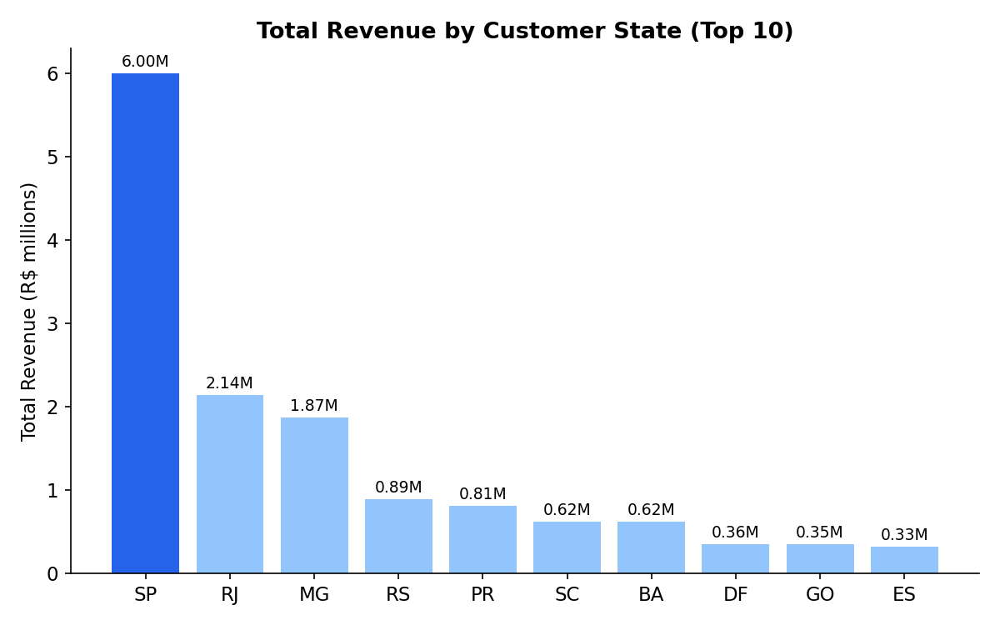
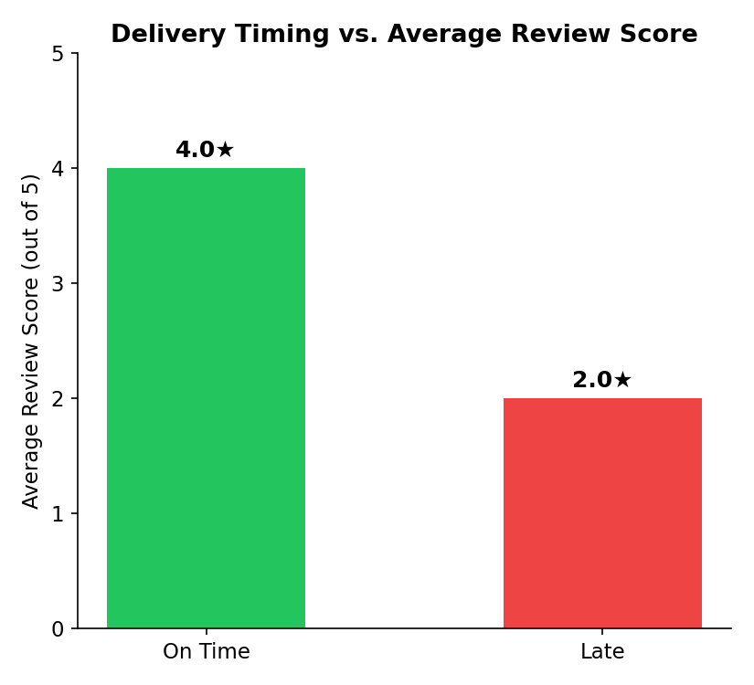
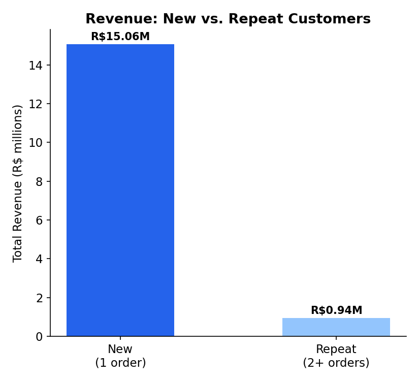
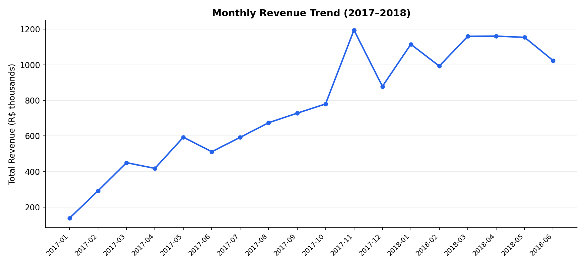
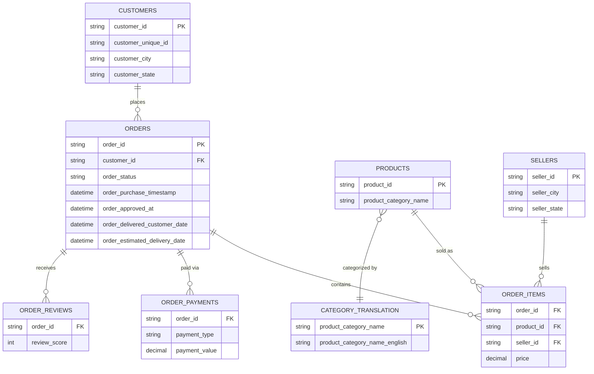

# Olist E-Commerce SQL Analysis


SQL analysis of a real Brazilian e-commerce marketplace (100k+ orders, 9 relational tables), answering
four business questions — revenue concentration, delivery impact on satisfaction, customer retention,
and seller performance — using joins, subqueries, CTEs, and window functions in T-SQL.

**Dataset:** [Brazilian E-Commerce Public Dataset by Olist](https://www.kaggle.com/datasets/olistbr/brazilian-ecommerce) (Kaggle, 2016–2018)
**Tools:** Microsoft SQL Server (T-SQL), SSMS

---

## Business Findings

**1. Revenue is heavily concentrated in one state.**
São Paulo (SP) generates R$5.99M in total revenue — nearly 3x Rio de Janeiro (R$2.14M), the next-closest state, and more than the next four states combined.



**2. Late delivery is strongly tied to customer satisfaction.**
Orders delivered after the estimated date average a **2.0★** review, versus **4.0★** for on-time orders — a two-star gap directly attributable to delivery timing.



**3. Revenue depends far more on new customers than repeat buyers.**
One-time customers account for R$15.06M in revenue versus R$0.94M from repeat customers.
This required identifying and correcting for a data quirk: Olist assigns a **new `customer_id` per order**, even for the same person, so `customer_unique_id` had to be used to correctly identify genuine repeat buyers — using `customer_id` alone would have made every customer appear to be a one-time buyer.



**4. Monthly revenue shows sustained, compounding growth.**
Revenue grew from ~R$138K/month in early 2017 to a stable R$1.0M–1.2M/month range through 2018.



**5. A combined seller scorecard (revenue + review score + late-delivery rate) surfaces risk that revenue alone hides.**
The top seller by revenue (R$229K) carries an 11.6% late-delivery rate — notably higher than several lower-ranked sellers with tighter delivery reliability, making them a candidate for performance review despite strong sales.

---

## Recommendations

1. Prioritize delivery reliability — it has the single clearest, most measurable link to customer satisfaction in this data.
2. Treat São Paulo as the core operating market for logistics and seller onboarding investment.
3. Since repeat purchases are rare, optimize the first-purchase experience rather than assuming loyalty-driven revenue.
4. Use combined seller scorecards, not revenue alone, to flag delivery-risk sellers before they affect platform-wide ratings.

---

## Repository Structure

```
olist-sql-analysis/
├── README.md
├── LICENSE
├── .gitignore
├── sql/
│   ├── 01_data_exploration.sql            -- SELECT, WHERE, ORDER BY, DISTINCT
│   ├── 02_filtering_and_segmentation.sql  -- CASE WHEN, IN, LIKE, BETWEEN, IS NULL
│   ├── 03_aggregation_and_metrics.sql     -- GROUP BY, HAVING, core business metrics
│   ├── 04_joins_and_relationships.sql     -- INNER/LEFT joins across the schema
│   ├── 05_subqueries.sql                  -- scalar, correlated, derived tables
│   ├── 06_ctes.sql                        -- single & chained CTEs
│   ├── 07_window_functions.sql            -- ROW_NUMBER, RANK, LAG, running totals
│   └── 08_business_insights_analysis.sql  -- the 4 findings above, in full
└── images/
    └── *.png
```

---

## Database Schema



---

## How to Run

1. Download the dataset from [Kaggle](https://www.kaggle.com/datasets/olistbr/brazilian-ecommerce).
2. Create a SQL Server database named `olist_ecommerce`.
3. Import the 9 CSVs as tables: `customers`, `orders`, `order_items`, `order_payments`, `order_reviews`, `products`, `sellers`, `geolocation`, `category_translation`.
4. Run the scripts in `/sql`, in order, in SSMS or another SQL client.

---

## Techniques Used

Multi-table joins (INNER/LEFT) · Correlated & derived-table subqueries · Single & chained CTEs ·
Window functions (`ROW_NUMBER`, `RANK`, `LAG`) · Aggregation & business-metric design · NULL handling in real-world data

---

## Author

**Lavit Chaudhary** — Business Analytics Student | SQL, Python (Pandas, Matplotlib, Seaborn), Power BI
[LinkedIn](https://linkedin.com/in/lavit-chaudhary) · [GitHub](https://github.com/LavitDecoded)

Licensed under [MIT](LICENSE).
